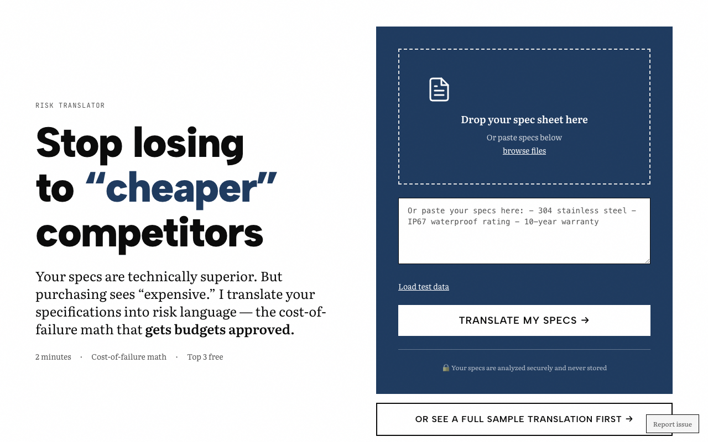

# Risk Translator

**Turn technical specs into risk-justified decisions that purchasing managers approve.**

Engineers know what's right technically but can't get it past purchasing. Purchasing sees "expensive" not "risk mitigation." This tool transforms technical specifications into risk language that procurement understands.

🔗 **Live app:** [risk-translator.vercel.app](https://risk-translator.vercel.app)

---

## What it does

1. **Analyzes your technical specs** - Upload a document or paste text
2. **Identifies risk gaps** - What's missing from your justification
3. **Translates to risk language** - Convert specs to cost-of-failure terms
4. **Generates purchasing-ready docs** - Executive summaries procurement actually reads

## Example transformations

| Before (technical) | After (risk-justified) |
|-------------------|------------------------|
| "304 stainless steel" | "Corrosion resistance preventing $22,000-$70,000 in replacement costs over 10 years" |
| "IP67 rating" | "Protection against water damage that has caused $8,000-$15,000 in warranty claims industry-wide" |
| "10-year warranty" | "Risk transfer: vendor assumes liability for failures, protecting against $15,000-$35,000 in unplanned replacement costs" |

## Screenshot



## Tech stack

- **Next.js 15** (App Router)
- **React 19** with TypeScript
- **Tailwind CSS** for styling
- **Stripe** for payments

## Features

- 📄 Free preview showing risk gaps
- 💰 Full risk-justified translations ($147)
- 📊 Cost-of-failure calculations with industry data
- 📝 Comparison framework vs. cheaper alternatives
- 📥 Downloadable PDF for purchasing

## Local development

```bash
git clone https://github.com/lee-fuhr/risk-translator.git
cd risk-translator
npm install --legacy-peer-deps
npm run dev
```

Server runs on http://localhost:3004

## Related tools

- [The Commodity Test](https://commodity-test.vercel.app) - Analyze your website messaging for generic language

---

Built by [Lee Fuhr](https://leefuhr.com) • Messaging strategy for companies that make things
